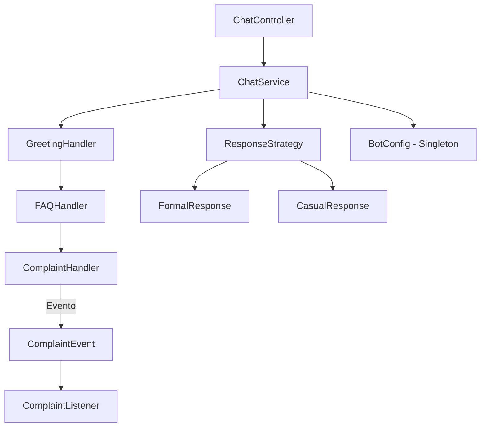

# MyBot API

Uma API simples de chatbot construída com Spring Boot, desenvolvida para demonstrar o uso de **padrões de projeto** em
um sistema real.

## 🚀 Funcionalidades

- **Chain of Responsibility**: Encadeia diferentes handlers para tratar mensagens (saudações, FAQs, reclamações).
- **Observer Pattern**: Publica eventos de reclamação e notifica listeners.
- **Strategy Pattern**: Formata respostas em estilos diferentes (formal ou casual) usando Spring Profiles.
- **Singleton Pattern**: Configuração global centralizada com `BotConfig`.

## 🧩 Arquitetura

- **Controller**: expõe o endpoint `/chat`.
- **Service**: processa mensagens através da cadeia de handlers e aplica a estratégia de resposta.
- **Handlers**:
    - `GreetingHandler`: responde a saudações.
    - `FAQHandler`: responde perguntas frequentes.
    - `ComplaintHandler`: detecta reclamações e dispara eventos.
- **Eventos**:
    - `ComplaintEvent`: representa uma reclamação.
    - `ComplaintListener`: escuta e reage às reclamações.
- **Estratégias**:
    - `FormalResponse`: respostas em estilo formal.
    - `CasualResponse`: respostas em estilo casual.
- **Singleton**:
    - `BotConfig`: armazena configuração global (tom, idioma).

## 🗂️ Diagrama da Arquitetura



## ✅ Pré-requisitos

- Java 21+
- Maven 3.8+

## ⚙️ Como executar

1. Inicie a aplicação:

```bash
   mvn spring-boot:run
```

2. Teste com HTTPie:

```bash
   http POST :8080/chat mensagem="Oi"
```

## 📚 Documentação da API

Após iniciar a aplicação, acesse:

http://localhost:8080/swagger-ui/index.html

Especificação OpenAPI:

http://localhost:8080/v3/api-docs


## 🧪 Exemplos

- **Saudação (perfil formal):**

```
  Bot: Olá, seja bem-vindo!
```

- **FAQ:**

```
  Bot: Funcionamos das 9h às 18h.
```

- **Reclamação:**

```
  Bot: Entendi sua reclamação, encaminhei para o suporte.
```

## 🔧 Configuração

Altere o estilo de resposta via Spring Profiles em `application.properties`:

```properties
spring.profiles.active=formal
# ou
spring.profiles.active=casual
```

Para atualizar o tom dinamicamente, utilize o endpoint `/config/tone` via `BotConfig`.
