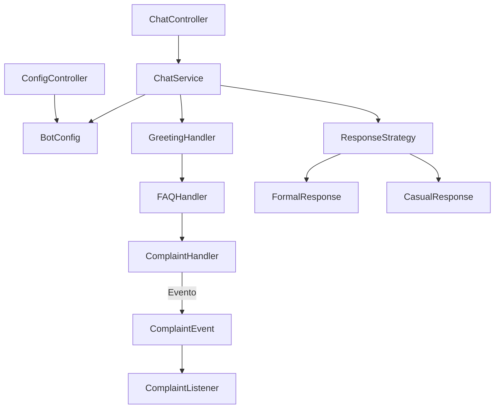

# MyBot API

Uma API simples de chatbot construída com Spring Boot, desenvolvida para demonstrar o uso de **padrões de projeto** em
um sistema real.

## 🚀 Funcionalidades

* **Chain of Responsibility**: Encadeia diferentes handlers para tratar mensagens (saudações, FAQs e reclamações).
* **Observer Pattern**: Publica eventos de reclamação e notifica listeners.
* **Strategy Pattern**: Formata respostas em estilos diferentes (formal ou casual).

## 🧩 Arquitetura

* **Controllers**:

    * `ChatController`: expõe o endpoint `/chat`.
    * `ConfigController`: expõe o endpoint `/config/tone`.
* **Service**:

    * `ChatService`: processa mensagens através da cadeia de handlers e aplica a estratégia de resposta.
* **Handlers**:

    * `GreetingHandler`: responde a saudações.
    * `FAQHandler`: responde perguntas frequentes.
    * `ComplaintHandler`: detecta reclamações e dispara eventos.
* **Eventos**:

    * `ComplaintEvent`: representa uma reclamação.
    * `ComplaintListener`: escuta e reage às reclamações.
* **Estratégias**:

    * `FormalResponse`: respostas em estilo formal.
    * `CasualResponse`: respostas em estilo casual.
* **Configuração**:

    * `BotConfig`: armazena configurações globais do chatbot (tom e idioma).

## 🗂️ Diagrama da Arquitetura



## ✅ Pré-requisitos

* Java 21+
* Maven 3.8+

## ⚙️ Como executar

1. Inicie a aplicação:

```bash
mvn spring-boot:run
```

## 📚 Documentação da API

Após iniciar a aplicação, acesse:

```text
http://localhost:8080/swagger-ui/index.html
```

Especificação OpenAPI:

```text
http://localhost:8080/v3/api-docs
```

## 📋 Exemplos

### Saudação

**Requisição**

```json
{
  "mensagem": "Oi"
}
```

**Resposta**

```json
{
  "resposta": "Bot (Formal): Bot: Olá, seja bem vindo!"
}
```

### FAQ

**Requisição**

```json
{
  "mensagem": "Qual o horário de funcionamento?"
}
```

**Resposta**

```json
{
  "resposta": "Bot (Formal): Bot: Funcionamos das 9h às 18h."
}
```

### Reclamação

**Requisição**

```json
{
  "mensagem": "Tenho uma reclamação"
}
```

**Resposta**

```json
{
  "resposta": "Bot (Formal): Bot: Entendi sua reclamação, encaminhei para o suporte."
}
```

### Alteração do tom do chatbot

**Requisição**

```json
{
  "tone": "casual"
}
```

**Resposta**

```json
{
  "mensagem": "Tom atualizado para: casual"
}
```

## 🧪 Executando os testes

Execute todos os testes automatizados:

```bash
mvn test
```

## 🔧 Configuração

Você pode alterar o perfil ativo em `application.properties`:

```properties
spring.profiles.active=formal
# ou
spring.profiles.active=casual
```

Ou alterar o tom dinamicamente utilizando o endpoint:

```text
PUT /config/tone
```

## 🎯 Padrões de Projeto Aplicados

### Chain of Responsibility

As mensagens percorrem uma cadeia de handlers especializados até que um deles seja capaz de processá-las.

### Strategy

Permite alterar o estilo das respostas sem modificar a lógica principal do chatbot.

### Observer

Reclamações geram eventos que podem ser tratados por listeners independentes, reduzindo o acoplamento entre os
componentes.

## 📄 Licença

Este projeto foi desenvolvido para fins educacionais e de demonstração.

## 👨‍💻 Autor

**Rodrigo Franco Jorge**

Desenvolvido como parte dos estudos em Java, Spring Boot e Padrões de Projeto.

- GitHub: https://github.com/Rshinna
- LinkedIn: https://linkedin.com/in/rodrigo-franco-jorge-905723246